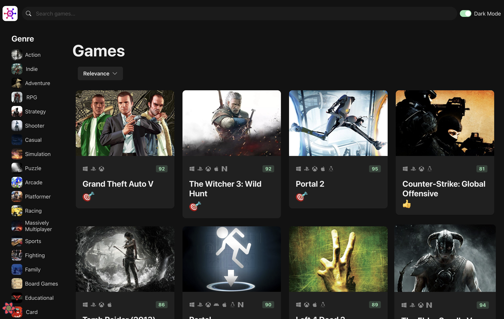
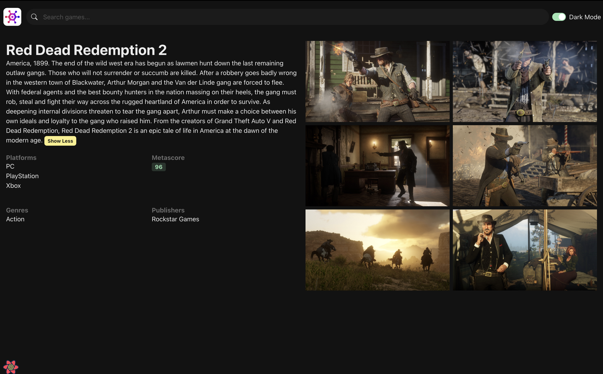

<div align="center">
<h3 align="center">Game Hub</h3>
</div>

<details open>
  <summary>Table of Contents</summary>
  <ol>
    <li>
      <a href="#about-the-project">About The Project</a>
    </li>
     <li>
      <a href="#built-with">Built With</a>
    </li>
    <li>
      <a href="#getting-started">Getting Started</a>
    </li>
  </ol>
</details>

## About The Project

Game Hub is a groundbreaking web application set to transform the gaming landscape by revolutionizing how players discover and engage with new titles. With an extensive database covering PC, console, and mobile platforms, the platform offers a diverse selection of games across all genres.

Features:

- Fetching and updating data with <strong>React Query</strong>.
- Global state management with <strong>Zustand</strong>
- Implemented <strong>Infinite Queries</strong> and <strong>Infinite Scroll</strong>
- Routing with <strong>React Router</strong>

 <div>
    
  </div>

 <div style="margin-top: 10px;">
    
</div>

## Built With

<a href="#"></a>

<a href="#"></a>

<a href="#"></a>

<a href="#"></a>

<p align="right">(<a href="#readme-top">back to top</a>)</p>

<!-- GETTING STARTED -->

## Getting Started

This section describes how you can setup the project locally. To get the local copy up and running follow these simple steps

1. Get a free API Key at [https://api.rawg.io/api](https://api.rawg.io/api)

2. Clone the repo
   ```sh
   git clone https://github.com/your_username_/Project-Name.git
   ```
3. Install NPM packages

   ```sh
   npm install
   ```

4. Enter your API in `api-client.ts`

   ```js
   params: {
    key: Enter Key Here
   }
   ```

5. Run the project

   ```sh
   npm run dev
   ```

   <p align="right">(<a href="#readme-top">back to top</a>)</p>
